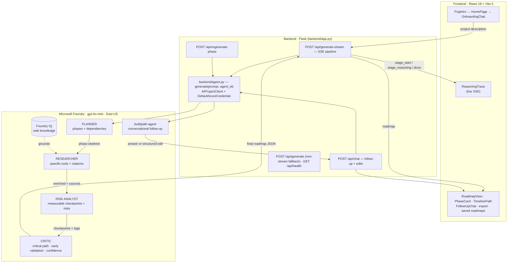

# BuildPath — Architecture

The five-agent reasoning pipeline and Foundry IQ grounding. Each agent consumes
the previous agent's structured output; the assembled roadmap is streamed to the
frontend over Server-Sent Events as each stage reasons.

## Stage contract

| Agent | Foundry ID | Input | Output |
|---|---|---|---|
| Planner | `buildpath-planner` | project data | ordered phase skeleton (title, description, duration, dependencies) + reasoning |
| Researcher | `buildpath-researcher` (Foundry IQ) | skeleton | `tools_required` + `sources[{label,url}]` per phase + reasoning |
| Risk Analyst | `buildpath-risk` | enriched phases | `checkpoints`, `risks`, `tags` per phase + reasoning |
| Critic | `buildpath-critic` | assembled roadmap | `summary`, `success_criteria`, `early_validation`, `critical_path`, `estimated_duration`, per-phase `confidence` + reasoning |
| Follow-up | `buildpath-agent` | roadmap + message + history | conversational reply, optionally a validated structured phase edit |

Any agent ID left unset falls back to `AZURE_AGENT_ID`, so the pipeline still runs
on a single-agent configuration. A failed stage degrades gracefully — the best
roadmap assembled so far is still returned.
